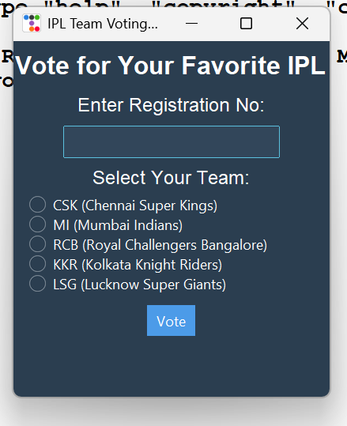

# 🏏 IPL Team Voting System

A simple GUI voting system for IPL teams using Python, Tkinter, and ttkbootstrap.

## 🎯 Features
✅ User authentication via registration numbers  
✅ Vote for IPL teams (CSK, MI, RCB, KKR, LSG)  
✅ Beautiful UI with ttkbootstrap theme  
✅ Automatic result display when voting completes  

## 📸 Screenshot  


## 📜 License  
This project is licensed under the **MIT License**. See the [LICENSE](LICENSE) file for details.


## 🛠 Installation
Follow these steps to install and run the project:

```sh
git clone https://github.com/mani123qwe/ipl_voting_system.git
cd ipl_voting_system
pip install -r requirements.txt
python ipl_voting.py


